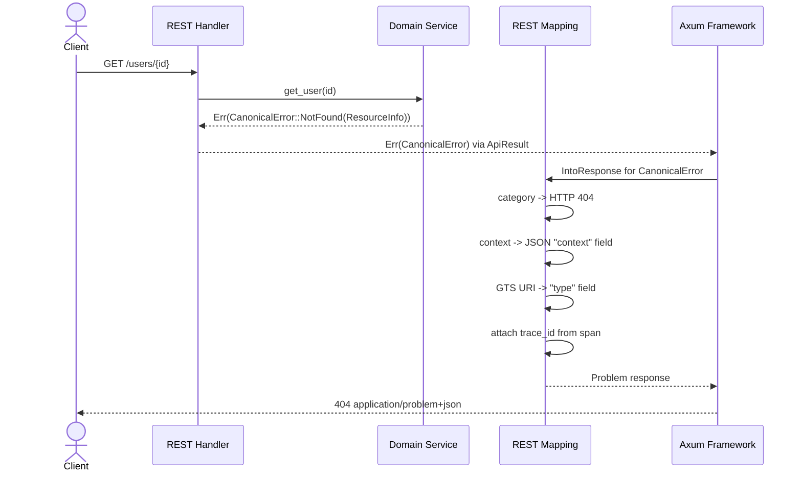
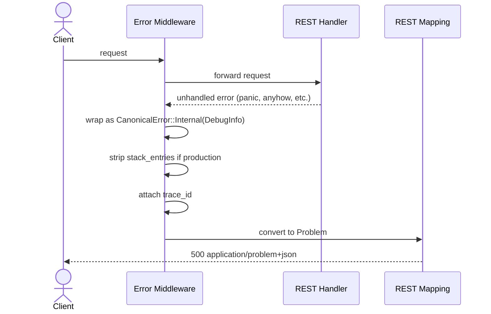
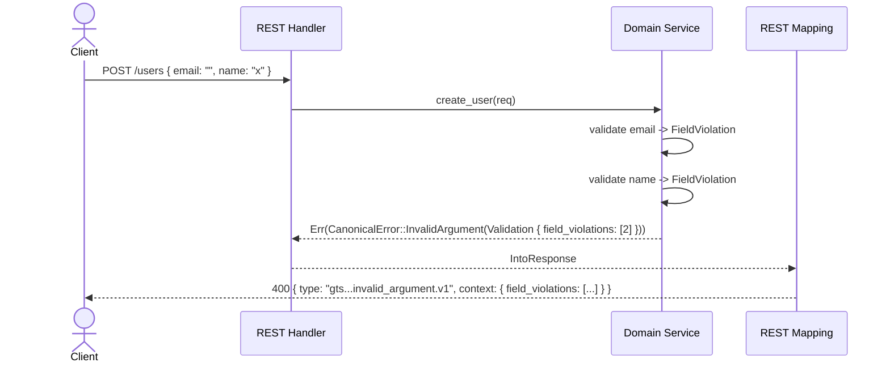

# Technical Design — Universal Error Architecture

## 1. Architecture Overview

### 1.1 Architectural Vision

CyberFabric adopts a transport-agnostic error model inspired by Google's canonical error codes (gRPC status codes). Every error produced anywhere in the platform is expressed as
one of 16 canonical categories (excluding OK). Each category carries a fixed-structure context payload that describes the error in a machine-readable way. No domain code references
HTTP status codes, gRPC codes, or any transport-specific detail.

The error categories are the single gateway between business logic and API layers. Modules construct a canonical error with its category-specific context. The API boundary (REST,
gRPC, SSE) maps that canonical error to the appropriate wire format: RFC 9457 Problem Details for REST, `google.rpc.Status` for gRPC (future), or a JSON event for SSE (future).

This design replaces module-specific ad-hoc error enums with a universal vocabulary. The GTS type system assigns each category a stable, globally unique identifier. Structured
context types (Validation, ResourceInfo, ErrorInfo, etc.) ensure that every error response carries precisely the metadata consumers need, in a predictable shape, with no risk of
leaking internal details.

### 1.2 Architecture Drivers

#### Functional Drivers

This is a cross-cutting platform design. Drivers are derived from the [PRD](./PRD.md) and platform-wide concerns.

| Driver                                       | PRD Requirement                             | Design Response                                  |
|----------------------------------------------|---------------------------------------------|--------------------------------------------------|
| Consistent error expression across modules   | `cpt-cf-fr-single-error-vocabulary`         | 16 canonical categories with GTS identifiers     |
| Machine-readable error details for consumers | `cpt-cf-fr-machine-readable-context`        | Fixed context structures per category            |
| Clean mapping to REST and gRPC wire formats  | `cpt-cf-fr-transport-agnostic-construction` | Transport-specific mapping at the boundary       |
| Trace correlation in error responses         | `cpt-cf-fr-trace-correlation`               | `trace_id` propagated from request context       |
| Low-boilerplate error construction           | `cpt-cf-fr-library-error-absorption`        | Typed constructors; blanket `From` impls         |
| No internal detail leakage                   | `cpt-cf-fr-no-internal-details`             | Fixed fields; `DebugInfo` stripped in production |
| Error contract as public API surface         | `cpt-cf-fr-error-contract-api-surface`      | Compile-time, snapshots, and semver enforcement  |
| Catch accidental changes before merge        | `cpt-cf-fr-accidental-change-protection`    | Exhaustive match, snapshots, semver CI gate      |

#### NFR Allocation

| NFR                                    | Design Response                                 | Verification                                   |
|----------------------------------------|-------------------------------------------------|------------------------------------------------|
| Consistency: same shape across modules | `CanonicalError` enum + typed contexts only     | Compile: handlers accept only `CanonicalError` |
| Observability: every error traceable   | `trace_id` from span context on every response  | Integration tests verify `trace_id` presence   |
| Performance: negligible overhead       | No heap allocation for category selection       | Benchmarks measure error path latency          |
| Security: no internals in production   | Stack entries stripped; opaque message returned | Security tests verify no stack traces          |

#### Key ADRs

This design supersedes the approach proposed in PR #290. The following ADR defines the implementation approach:

| ADR                                                                                | Summary                                                      |
|------------------------------------------------------------------------------------|--------------------------------------------------------------|
| [`cpt-cf-adr-canonical-error-impl`](./ADR/0001-cpt-cf-adr-canonical-error-impl.md) | Typed-variant enum; exhaustive mapping; blanket `From` impls |

### 1.3 Architecture Layers

```text
Module Domain Logic
        |
        v
CanonicalError { category, message, context, trace_id }
        |
        +-------> REST boundary:  CanonicalError -> Problem (RFC 9457)
        +-------> gRPC boundary:  CanonicalError -> google.rpc.Status (future)
        +-------> SSE boundary:   CanonicalError -> JSON error event (future)
```

| Layer                 | Responsibility                                      | Technology                                              |
|-----------------------|-----------------------------------------------------|---------------------------------------------------------|
| Domain                | Construct canonical errors from business logic      | `CanonicalError` enum, context structs                  |
| Error Catalog         | Assign GTS identifiers to categories                | GTS type URIs, compile-time constants                   |
| REST Mapping          | Convert canonical errors to RFC 9457 Problem        | `From<CanonicalError> for Problem`, Axum `IntoResponse` |
| gRPC Mapping (future) | Convert canonical errors to gRPC Status             | `From<CanonicalError> for tonic::Status`                |
| Middleware            | Enrich errors with trace ID, catch unhandled errors | `error_mapping_middleware`                              |

## 2. Principles & Constraints

### 2.1 Design Principles

#### Transport Agnosticism

- [ ] `p1` - **ID**: `cpt-cf-principle-transport-agnosticism`

Domain and SDK code never references HTTP status codes, gRPC codes, or any wire-format detail. The canonical error categories are the only error vocabulary available to business
logic. Transport-specific mapping happens exclusively at the API boundary.

#### Single Error Gateway

- [ ] `p1` - **ID**: `cpt-cf-principle-single-error-gateway`

The `CanonicalError` type is the only error type accepted by API layers. There is no alternative path for returning errors. This eliminates inconsistent error formats across
modules and ensures every error response follows the same structure.

#### Fixed Context Structures

- [ ] `p1` - **ID**: `cpt-cf-principle-fixed-context-structures`

Each canonical category has exactly one associated context type with a fixed set of fields. This prevents ad-hoc metadata keys, ensures consumers can parse error details without
guessing, and makes the error surface auditable at compile time.

#### Catalog-First

- [ ] `p2` - **ID**: `cpt-cf-principle-catalog-first`

Every canonical category has a GTS identifier assigned before any code is written. The catalog is the source of truth for error codes.

#### Fail-Safe Fallback

- [ ] `p2` - **ID**: `cpt-cf-principle-fail-safe-fallback`

Any error that does not match a canonical category is mapped to `internal` with a trace ID. The error middleware catches panics, unhandled rejections, and unknown error types,
wrapping them as `internal` errors. No error escapes the system without a canonical category.

### 2.2 Constraints

#### RFC 9457 Compliance

- [ ] `p1` - **ID**: `cpt-cf-constraint-rfc9457`

All REST error responses use `Content-Type: application/problem+json` and include the RFC 9457 fields: `type`, `title`, `status`, `detail`, and `instance`. The `type` field carries
the GTS URI for the error category.

#### GTS Code Format

- [ ] `p1` - **ID**: `cpt-cf-constraint-gts-code-format`

Error category GTS identifiers use the compound GTS type format: `gts.cf.core.errors.err.v1~cf.core.errors.{category}.v1~` where `{category}` is the lowercase canonical category
name (e.g., `not_found`, `invalid_argument`). The `err.v1` prefix identifies the base error schema and the `~` separator is part of the GTS compound type syntax.

#### No Internal Details in Production

- [ ] `p1` - **ID**: `cpt-cf-constraint-no-internal-details`

`DebugInfo.stack_entries` is populated only when the application runs in debug mode. In production, `internal` and `unknown` errors return an opaque message with a `trace_id` for
correlation. The `detail` field for `internal` errors contains a generic message, never exception text or stack traces.

#### Error Contract Stability

- [ ] `p1` - **ID**: `cpt-cf-constraint-error-contract-stability`

Every error response consists of **contract parts** (fixed per category) and **variable parts** (per-occurrence). The contract parts — canonical category, context type schema (
field names and types), GTS identifier, HTTP status code, and title — are part of the public API surface. Changes to contract parts follow the same breaking change policy as
endpoint signature changes. Variable parts — `detail` message, `instance` path, `trace_id`, and context field values — are not part of the contract and may change freely.
Specifically:

**Breaking changes** (require major version bump of `cf-modkit-errors`):

- Removing or renaming a canonical category
- Changing the context type associated with a category
- Removing or renaming a field in a context type schema
- Changing the type of a field in a context type schema
- Changing the GTS identifier of a category
- Changing the HTTP status code mapped to a category

**Non-breaking changes** (minor version):

- Adding a new optional field to a context type
- Adding a new canonical category

**Enforcement mechanisms**:

- Exhaustive match on `CanonicalError` enum produces compile errors when categories change
- Macro-based GTS construction prevents GTS identifier typos and drift (see `cpt-cf-constraint-macro-gts-construction`)
- Snapshot tests capture the JSON shape of error responses per category; changes require explicit acknowledgment
- Semver compatibility checks on `cf-modkit-errors` detect breaking changes to public types before merge

#### Macro-Based GTS Construction

- [ ] `p1` - **ID**: `cpt-cf-constraint-macro-gts-construction`

Resource types **must** be declared via attribute macros that associate a GTS identifier with a named type. The macro:

1. **Validates the GTS format at compile time** — rejects strings that do not match the `gts.{prefix}.{path}.v{N}` pattern
2. **Generates error constructors for 15 canonical categories** — the declared resource type becomes the primary entry point for constructing any error scoped to that resource. The
   macro generates all categories except `service_unavailable`, which is exclusively a system-level error.
3. **Tags every generated constructor with `resource_type`** — each generated function calls `.with_resource_type(gts_type)` on the resulting `CanonicalError`, ensuring the
   resource identity is carried through to the Problem response

**Declaration** (once per resource type, in the module):

```rust
#[resource_error("gts.cf.core.users.user.v1")]
struct UserResourceError;
```

**Usage** (at error sites):

```rust
// ResourceInfo categories — GTS type baked into the context:
UserResourceError::not_found(user_id)
UserResourceError::already_exists(email)

// Other categories — context provided explicitly, resource identity carried by the macro:
UserResourceError::invalid_argument(Validation::fields([
FieldViolation::new("email", "must be a valid email address", "INVALID_FORMAT"),
]))
UserResourceError::permission_denied(ErrorInfo::new("CROSS_TENANT_ACCESS", "auth.cyberfabric.io"))
UserResourceError::failed_precondition(PreconditionFailure::new([
PreconditionViolation::new("STATE", "user.status", "User must be active"),
]))
```

For `not_found`, `already_exists`, and `data_loss`, the macro generates a `ResourceInfo` context with the GTS type baked in. For all other generated categories, the macro wraps
the caller-provided context in a `CanonicalError` and calls `.with_resource_type(gts_type)`. This injects the resource identity into the `context` field of the Problem response,
allowing consumers to identify which resource an error relates to regardless of the error category. When a direct constructor (`CanonicalError::category(...)`) is used,
`resource_type` is absent from the context.

**Non-resource errors** (not scoped to a specific resource) use direct `CanonicalError::` constructors:

```rust
// System-level errors:
CanonicalError::service_unavailable(RetryInfo::after_seconds(30))

// Malformed request body (no resource context):
CanonicalError::invalid_argument(Validation::format("request body is not valid JSON"))
```

Note: categories like `unauthenticated`, `resource_exhausted`, and `unknown` can also be constructed via the macro (which adds `resource_type`) or directly (which omits it),
depending on whether the error is scoped to a specific resource.

This constraint applies to all context type fields that carry GTS identifiers. Currently, `ResourceInfo.resource_type` is the only such field. `PreconditionViolation.type` (which
carries free-form precondition categories like `STATE`, `TOS`) is not a GTS identifier and is not subject to this constraint.

## 3. Technical Architecture

### 3.1 Domain Model

**Technology**: Rust enums and structs

**Location**: `libs/modkit-errors/src/`

**Core Entities**:

> All types in `libs/modkit-errors/src/` — `CanonicalError` in `canonical.rs`, all others in `context.rs`. Context types use versioned names (`XxxV1`) with
> unversioned aliases (`pub type Xxx = XxxV1;`).

| Entity                  | Description                                                                             |
|-------------------------|-----------------------------------------------------------------------------------------|
| `CanonicalError`        | Enum with 16 variants, each carrying its category-specific context                      |
| `Validation`            | Context for `invalid_argument` and `out_of_range`                                       |
| `FieldViolation`        | Single field validation error within `Validation`                                       |
| `ResourceInfo`          | Context for `not_found`, `already_exists`, `data_loss`                                  |
| `ErrorInfo`             | Context for `permission_denied`, `aborted`, `unimplemented`, `unauthenticated`          |
| `QuotaFailure`          | Context for `resource_exhausted`                                                        |
| `QuotaViolation`        | Single quota violation within `QuotaFailure`                                            |
| `PreconditionFailure`   | Context for `failed_precondition`                                                       |
| `PreconditionViolation` | Single precondition violation within `PreconditionFailure`                              |
| `DebugInfo`             | Context for `unknown` and `internal`; optional on any category via `.with_debug_info()` |
| `RetryInfo`             | Context for `service_unavailable`; optionally embedded in `QuotaFailure`                |

**Relationships**:

- `CanonicalError` contains exactly one context type per variant
- `Validation` contains one or more `FieldViolation` entries
- `QuotaFailure` contains one or more `QuotaViolation` entries
- `PreconditionFailure` contains one or more `PreconditionViolation` entries
- All context types are self-contained value objects with no external dependencies

### 3.2 Component Model

```text
+------------------------------------------------------------------+
|                       Module Domain Logic                         |
|  (constructs CanonicalError with category + context)              |
+------------------------------------------------------------------+
        |
        v
+------------------------------------------------------------------+
|                     CanonicalError Enum                           |
|  libs/modkit-errors/src/canonical.rs                              |
|                                                                   |
|  Variants (struct-style, each has ctx + message + resource_type  |
|            + debug_info):                                        |
|    Cancelled { message: String, ... }                             |
|    Unknown { ctx: DebugInfo, ... }                                |
|    InvalidArgument { ctx: Validation, ... }                       |
|    DeadlineExceeded { message: String, ... }                      |
|    NotFound { ctx: ResourceInfo, ... }                            |
|    AlreadyExists { ctx: ResourceInfo, ... }                       |
|    PermissionDenied { ctx: ErrorInfo, ... }                       |
|    ResourceExhausted { ctx: QuotaFailure, ... }                   |
|    FailedPrecondition { ctx: PreconditionFailure, ... }           |
|    Aborted { ctx: ErrorInfo, ... }                                |
|    OutOfRange { ctx: Validation, ... }                            |
|    Unimplemented { ctx: ErrorInfo, ... }                          |
|    Internal { ctx: DebugInfo, ... }                               |
|    ServiceUnavailable { ctx: RetryInfo, ... }                     |
|    DataLoss { ctx: ResourceInfo, ... }                            |
|    Unauthenticated { ctx: ErrorInfo, ... }                        |
+------------------------------------------------------------------+
        |                                    |
        v                                    v
+-------------------------+    +---------------------------+
|    REST Mapping Layer   |    |   gRPC Mapping Layer      |
|  libs/modkit-errors/    |    |   (future)                |
|  src/problem.rs         |    |                           |
|                         |    |  CanonicalError           |
|  CanonicalError         |    |    -> tonic::Status       |
|    -> Problem (RFC9457) |    |    + detail messages      |
+-------------------------+    +---------------------------+
        |                                    |
        v                                    v
+-------------------------+    +---------------------------+
|  Axum IntoResponse      |    |  tonic IntoResponse       |
|  application/            |    |  gRPC trailers            |
|    problem+json          |    |  (future)                 |
+-------------------------+    +---------------------------+
```

#### Construction Paths

Two entry points converge into the same `CanonicalError` type. Resource-scoped construction (via `#[resource_error]` macro) automatically tags every error with the resource's GTS
identity. Non-resource construction uses `CanonicalError::` directly, with no resource identity attached. Both paths produce the same enum, which then maps to any transport
representation.

```text
 Resource-scoped construction              Non-resource construction
 ─────────────────────────────             ──────────────────────────
 #[resource_error("gts...")]               CanonicalError::category(ctx)
 UserResourceError::not_found(id)          CanonicalError::service_unavailable(...)
 UserResourceError::permission_denied(ei)  CanonicalError::invalid_argument(...)
         │                                          │
         │  .with_resource_type(gts) auto           │  resource_type = None
         └──────────────┬───────────────────────────┘
                        │
                        v
              ┌─────────────────┐
              │  CanonicalError  │
              │  (16 variants)   │
              └────────┬────────┘
                       │
          ┌────────────┼────────────┐
          v            v            v
    Problem(REST)  Status(gRPC)  Event(SSE)
      RFC 9457      (future)     (future)
```

#### CanonicalError

- [ ] `p1` - **ID**: `cpt-cf-component-canonical-error`

##### Why this component exists

Provides a single, universal error type that all modules use to express failures. Eliminates per-module ad-hoc error enums and ensures every error has a category and structured
context.

##### Responsibility scope

Owns the 16 canonical error categories. Owns the mapping from category to GTS identifier. Each variant is a struct with three fields: `ctx` (category-specific context type),
`message: String` (human-readable detail with a sensible default per category), `resource_type: Option<String>` (set by macro-generated constructors, `None` for direct
constructors), and `debug_info: Option<DebugInfo>` (optional diagnostic context, attached post-construction via builder, `None` by default). Provides ergonomic constructors (one
per category), builder methods (`with_message()`, `with_resource_type()`, `with_debug_info()`), and accessors (`message()`, `resource_type()`, `debug_info()`,
`gts_type()`, `status_code()`, `title()`). The `unknown()` constructor is a convenience that takes `impl Into<String>` and wraps it in `DebugInfo` internally. Provides blanket
`From` implementations for common library error types (`anyhow::Error`, `sea_orm::DbErr`, `sqlx::Error`, `serde_json::Error`, `std::io::Error`) so that the `?` operator propagates
library errors into canonical categories without per-call-site mapping.

##### Responsibility boundaries

Does not know about HTTP, gRPC, or any transport. Does not perform serialization. Does not enrich errors with trace IDs (that is the middleware's job).

##### Related components (by ID)

- `cpt-cf-component-context-types` — provides the context structs carried by each variant
- `cpt-cf-component-rest-mapping` — consumes `CanonicalError` and produces `Problem`
- `cpt-cf-component-error-middleware` — catches unhandled errors and wraps them as `CanonicalError`

#### Context Types

- [ ] `p1` - **ID**: `cpt-cf-component-context-types`

##### Why this component exists

Each canonical category needs structured metadata that consumers can parse predictably. Context types provide fixed-schema payloads per category, following Google's error detail
model.

##### Responsibility scope

Defines `Validation`, `ResourceInfo`, `ErrorInfo`, `QuotaFailure`, `PreconditionFailure`, `DebugInfo`, and `RetryInfo` structs. All context types use versioned
naming (`XxxV1`) with unversioned type aliases (e.g., `pub type ResourceInfo = ResourceInfoV1;`) to support future schema evolution. Each struct has a fixed set of public fields
and provides builder/constructor methods for ergonomic construction. All context types implement the `GtsSchema` trait (via `#[struct_to_gts_schema]` macro) and carry an internal
`gts_type: GtsSchemaId` field that is skipped during serialization.

##### Responsibility boundaries

Context types are pure data. They do not perform validation, logging, or transport mapping. GTS format validation is performed at compile time by the attribute macro, not at
runtime by the context type itself.

##### Related components (by ID)

- `cpt-cf-component-canonical-error` — uses context types as variant payloads

#### REST Mapping Layer

- [ ] `p1` - **ID**: `cpt-cf-component-rest-mapping`

##### Why this component exists

The REST API boundary must convert `CanonicalError` into RFC 9457 Problem Details responses. This component owns the category-to-HTTP-status mapping and the serialization of
context types into the Problem response body.

##### Responsibility scope

Implements `From<CanonicalError> for Problem` and `Problem::from_error(err)` (production mode — omits debug info) and `Problem::from_error_debug(err)` (debug mode — includes debug
info if present as a top-level `"debug"` key, sibling to `context`). Maps each category to its HTTP status code. Serializes context type fields into the Problem `context` field.
Sets the `type` field to the GTS URI.

##### Responsibility boundaries

Does not construct canonical errors. Does not handle gRPC or SSE mapping.

##### Related components (by ID)

- `cpt-cf-component-canonical-error` — the input type
- `cpt-cf-component-error-middleware` — invokes this mapping for unhandled errors

#### Error Middleware

- [ ] `p2` - **ID**: `cpt-cf-component-error-middleware`

##### Why this component exists

Not all errors reach the API handler in canonical form. Panics and framework errors need a catch-all layer that ensures every HTTP response is a well-formed Problem.

##### Responsibility scope

Catches unhandled errors and maps them to `CanonicalError::Internal`. Enriches all error responses with `trace_id` from the request context.

##### Responsibility boundaries

Does not construct domain-specific errors. Does not modify errors that are already canonical.

##### Related components (by ID)

- `cpt-cf-component-rest-mapping` — delegates to for `CanonicalError` to `Problem` conversion
- `cpt-cf-component-canonical-error` — wraps unhandled errors as `Internal` variant

#### GTS Error Catalog

- [ ] `p2` - **ID**: `cpt-cf-component-gts-catalog`

##### Why this component exists

Each canonical category needs a stable, globally unique GTS identifier for the `type` field in error responses and for cross-system error correlation.

##### Responsibility scope

Defines the 16 GTS identifiers as compile-time constants. Provides lookup from category enum variant to GTS URI string.

##### Responsibility boundaries

Does not define context types or transport mappings. The catalog is a static mapping.

##### Related components (by ID)

- `cpt-cf-component-canonical-error` — uses catalog constants for GTS type URIs
- `cpt-cf-component-rest-mapping` — reads GTS URI for the Problem `type` field

### 3.3 API Contracts

**Technology**: REST/JSON (RFC 9457)

#### Canonical Error Categories

- [ ] `p1` - **ID**: `cpt-cf-interface-canonical-categories`

**Technology**: Rust enum (internal), JSON (wire)

The 16 canonical error categories, their GTS identifiers, associated context types, and HTTP status mappings:

| #  | Category              | GTS Identifier                                                     | Context Type          | HTTP Status |
|----|-----------------------|--------------------------------------------------------------------|-----------------------|-------------|
| 1  | `cancelled`           | `gts.cf.core.errors.err.v1~cf.core.errors.cancelled.v1~`           | `String` (message)    | 499         |
| 2  | `unknown`             | `gts.cf.core.errors.err.v1~cf.core.errors.unknown.v1~`             | `DebugInfo`           | 500         |
| 3  | `invalid_argument`    | `gts.cf.core.errors.err.v1~cf.core.errors.invalid_argument.v1~`    | `Validation`          | 400         |
| 4  | `deadline_exceeded`   | `gts.cf.core.errors.err.v1~cf.core.errors.deadline_exceeded.v1~`   | `String` (message)    | 504         |
| 5  | `not_found`           | `gts.cf.core.errors.err.v1~cf.core.errors.not_found.v1~`           | `ResourceInfo`        | 404         |
| 6  | `already_exists`      | `gts.cf.core.errors.err.v1~cf.core.errors.already_exists.v1~`      | `ResourceInfo`        | 409         |
| 7  | `permission_denied`   | `gts.cf.core.errors.err.v1~cf.core.errors.permission_denied.v1~`   | `ErrorInfo`           | 403         |
| 8  | `resource_exhausted`  | `gts.cf.core.errors.err.v1~cf.core.errors.resource_exhausted.v1~`  | `QuotaFailure`        | 429         |
| 9  | `failed_precondition` | `gts.cf.core.errors.err.v1~cf.core.errors.failed_precondition.v1~` | `PreconditionFailure` | 400         |
| 10 | `aborted`             | `gts.cf.core.errors.err.v1~cf.core.errors.aborted.v1~`             | `ErrorInfo`           | 409         |
| 11 | `out_of_range`        | `gts.cf.core.errors.err.v1~cf.core.errors.out_of_range.v1~`        | `Validation`          | 400         |
| 12 | `unimplemented`       | `gts.cf.core.errors.err.v1~cf.core.errors.unimplemented.v1~`       | `ErrorInfo`           | 501         |
| 13 | `internal`            | `gts.cf.core.errors.err.v1~cf.core.errors.internal.v1~`            | `DebugInfo`           | 500         |
| 14 | `service_unavailable` | `gts.cf.core.errors.err.v1~cf.core.errors.service_unavailable.v1~` | `RetryInfo`           | 503         |
| 15 | `data_loss`           | `gts.cf.core.errors.err.v1~cf.core.errors.data_loss.v1~`           | `ResourceInfo`        | 500         |
| 16 | `unauthenticated`     | `gts.cf.core.errors.err.v1~cf.core.errors.unauthenticated.v1~`     | `ErrorInfo`           | 401         |

#### Context Type Schemas

- [ ] `p1` - **ID**: `cpt-cf-interface-context-schemas`

**Technology**: Rust structs and enums (internal), JSON (wire)

**Validation** (enum) — used by `invalid_argument`, `out_of_range`:

| Variant           | Payload               | Use Case                                                       |
|-------------------|-----------------------|----------------------------------------------------------------|
| `FieldViolations` | `Vec<FieldViolation>` | One or more fields failed validation                           |
| `Format`          | `String`              | Request body is malformed (e.g., invalid JSON, wrong encoding) |
| `Constraint`      | `String`              | A general constraint was violated (not field-specific)         |

**FieldViolation**:

| Field         | Type     | Description                                                                                                                                                                                |
|---------------|----------|--------------------------------------------------------------------------------------------------------------------------------------------------------------------------------------------|
| `field`       | `String` | XPath-style dot-separated path to the invalid field, with bracket notation for array indices (e.g., `user.email`, `items[0].name`). Extensions to the path syntax require a design change. |
| `description` | `String` | Human-readable explanation of why the field is invalid                                                                                                                                     |
| `reason`      | `String` | Machine-readable reason code, UPPER_SNAKE_CASE (e.g., `INVALID_FORMAT`)                                                                                                                    |

**ResourceInfo** — used by `not_found`, `already_exists`, `data_loss`:

| Field           | Type     | Description                                                          |
|-----------------|----------|----------------------------------------------------------------------|
| `resource_type` | `String` | GTS URI (e.g., `gts.cf.core.users.user.v1`). Set by macro or caller. |
| `resource_name` | `String` | Identifier of the resource (e.g., UUID, name)                        |
| `description`   | `String` | Human-readable context about the error                               |

**ErrorInfo** — used by `permission_denied`, `aborted`, `unimplemented`, `unauthenticated`:

| Field      | Type                      | Description                                                                             |
|------------|---------------------------|-----------------------------------------------------------------------------------------|
| `reason`   | `String`                  | Machine-readable reason, UPPER_SNAKE_CASE (e.g., `TOKEN_EXPIRED`, `SCOPE_INSUFFICIENT`) |
| `domain`   | `String`                  | Logical grouping (e.g., `auth.cyberfabric.io`, `types-registry`)                        |
| `metadata` | `HashMap<String, String>` | Arbitrary key-value pairs for additional context                                        |

**QuotaFailure** — used by `resource_exhausted`:

| Field        | Type                  | Description                                                                           |
|--------------|-----------------------|---------------------------------------------------------------------------------------|
| `violations` | `Vec<QuotaViolation>` | List of quota violations                                                              |
| `retry_info` | `Option<RetryInfo>`   | Optional retry guidance (e.g., `Retry-After` header source). Via `.with_retry_info()` |

**QuotaViolation**:

| Field           | Type          | Description                                                              |
|-----------------|---------------|--------------------------------------------------------------------------|
| `subject`       | `String`      | What the quota applies to (e.g., `requests_per_minute`, `storage_bytes`) |
| `description`   | `String`      | Human-readable explanation of the quota violation                        |
| `limit`         | `Option<u64>` | Quota limit value (e.g., 100). Via `.with_limit()`                       |
| `remaining`     | `Option<u64>` | Remaining quota at the time of violation. Via `.with_remaining()`        |
| `reset_seconds` | `Option<u64>` | Seconds until quota resets. Via `.with_reset()`                          |

> The optional `limit`/`remaining`/`reset_seconds` fields enable returning
> `RateLimit-Policy` and `X-RateLimit-*` headers per the
> [REST API standard](https://github.com/cyberfabric/DNA/blob/main/REST/API.md#10-rate-limiting--quotas).
> All three are populated via builder methods — omitting them is valid when
> the quota system does not expose policy details.

**PreconditionFailure** — used by `failed_precondition`:

| Field        | Type                         | Description                     |
|--------------|------------------------------|---------------------------------|
| `violations` | `Vec<PreconditionViolation>` | List of precondition violations |

**PreconditionViolation**:

| Field         | Type     | Description                                             |
|---------------|----------|---------------------------------------------------------|
| `type`        | `String` | Precondition category (e.g., `TOS`, `STATE`, `VERSION`) |
| `subject`     | `String` | What failed the precondition check                      |
| `description` | `String` | How to resolve the failure                              |

**DebugInfo** — used by `unknown`, `internal`:

| Field           | Type          | Description                                          |
|-----------------|---------------|------------------------------------------------------|
| `detail`        | `String`      | Human-readable debug message (generic in production) |
| `stack_entries` | `Vec<String>` | Stack trace entries (empty in production)            |

**RetryInfo** — used by `service_unavailable`:

| Field                 | Type  | Description                             |
|-----------------------|-------|-----------------------------------------|
| `retry_after_seconds` | `u64` | Minimum seconds to wait before retrying |

> `cancelled` and `deadline_exceeded` take a simple message string — no
> typed context struct. The `trace_id` (always present on every Problem
> response) is sufficient for request correlation, making a separate
> `RequestInfo.request_id` redundant. Debug info can be attached optionally
> via `.with_debug_info()` if needed.

#### RFC 9457 Problem Wire Format

- [ ] `p2` - **ID**: `cpt-cf-interface-problem-wire-format`

**Technology**: JSON (`application/problem+json`)

Every REST error response follows this structure. Each field is classified as **contract** (fixed per category, consumers may depend on it) or **variable** (changes per occurrence,
consumers must not depend on specific values):

| Field      | Source                   | Part                              | Description                                                                         |
|------------|--------------------------|-----------------------------------|-------------------------------------------------------------------------------------|
| `type`     | GTS URI from category    | **Contract**                      | Error type URI (e.g., `gts.cf.core.errors.err.v1~cf.core.errors.not_found.v1~`)     |
| `title`    | Static per category      | **Contract**                      | Human-readable summary (e.g., "Not Found")                                          |
| `status`   | HTTP status from mapping | **Contract**                      | HTTP status code as integer                                                         |
| `detail`   | `CanonicalError.message` | Variable                          | Human-readable explanation of this occurrence                                       |
| `instance` | Request URI path         | Variable                          | URI identifying this specific occurrence                                            |
| `trace_id` | Request context          | Variable                          | W3C trace ID for correlation                                                        |
| `context`  | Serialized context type  | Contract schema / Variable values | Category-specific structured details; includes `resource_type` when resource-scoped |

RFC 9457 defines five standard members (`type`, `title`, `status`, `detail`, `instance`) and explicitly permits **extension members** (RFC 9457 §3.2). The fields `trace_id` and
`context` are CyberFabric-specific extensions.

The `context` field contains the JSON serialization of the context type associated with the error category. When the error is constructed via a resource-scoped constructor
(`XxxResourceError::category(...)`), a `resource_type` key is injected into the `context` object identifying the GTS URI of the affected resource. When a direct constructor
(`CanonicalError::category(...)`) is used, `resource_type` is absent from context.

The **schema** of `context` (field names and types) is contract — it is fixed per category and defined by the context type structs. The **values** within `context` are variable —
they are filled in by module code per occurrence. Consumers use `type` to determine the schema of `context` and may parse context fields by name, but must not depend on specific
field values.

### 3.4 Internal Dependencies

| Dependency         | Interface                         | Purpose                                                          |
|--------------------|-----------------------------------|------------------------------------------------------------------|
| `cf-modkit`        | `api::prelude`                    | Re-exports `CanonicalError`, `Problem`, `ApiResult` for handlers |
| `cf-modkit-errors` | `canonical`, `context`, `problem` | Core error types, context structs, REST mapping                  |
| `gts`              | `GtsSchema` trait                 | Schema trait implemented by all context types                    |
| `gts-macros`       | `#[struct_to_gts_schema]`         | Derive macro for GTS schema generation on context types          |
| `gts-id`           | `GtsSchemaId`                     | Validated GTS identifier type used internally by context types   |
| `schemars`         | JSON Schema support               | JSON Schema generation for context type schemas                  |
| `tracing`          | `Span::current()`                 | Extract trace ID from span for error enrichment                  |

### 3.5 External Dependencies

Not applicable. The universal error architecture is entirely internal to the CyberFabric platform. It does not depend on external services or systems. Error responses are produced
locally from in-process error construction and mapping.

### 3.6 Interactions & Sequences

#### Domain Error to REST Response (Happy Error Path)

- [ ] `p1` - **ID**: `cpt-cf-seq-domain-error-to-rest`

A module handler encounters a business error and returns it as a `CanonicalError`. Axum's `IntoResponse` impl converts it to an RFC 9457 Problem response.



**Description**: The standard path for returning business errors. The handler uses `?` to propagate `CanonicalError` through `ApiResult<T>`. The `IntoResponse` implementation
handles the full conversion chain.

#### Unhandled Error to REST Response (Middleware Catch-All)

- [ ] `p1` - **ID**: `cpt-cf-seq-unhandled-error`

An unexpected error (panic or framework error) bypasses the canonical error path. The error middleware catches it and wraps it as an `Internal` canonical error.



**Description**: The safety net ensuring no error escapes without a canonical category. In production, the response contains only a generic detail message and a trace ID for log
correlation.

#### Validation Error with Multiple Field Violations

- [ ] `p2` - **ID**: `cpt-cf-seq-validation-error`

A domain service validates input and accumulates multiple field violations before returning a single `InvalidArgument` error with all violations.



**Description**: Demonstrates how validation errors carry structured, machine-readable field-level detail that API consumers can use for form-level error display.

### 3.7 Database schemas & tables

Not applicable. Errors are transient values constructed in-process and serialized to wire format. There are no error-specific database tables. Error persistence (for audit,
analytics, or debugging) is handled by the observability stack (logging, tracing) which is outside the scope of this design.

## 4. Additional context

### Category Selection Guide

When to use each canonical category:

| Category              | Use When                                                                                            |
|-----------------------|-----------------------------------------------------------------------------------------------------|
| `invalid_argument`    | Client sent malformed or invalid input (validation errors, bad format, missing required fields)     |
| `not_found`           | A specific requested resource does not exist                                                        |
| `already_exists`      | Client tried to create a resource that already exists                                               |
| `permission_denied`   | Caller is authenticated but lacks permission for this operation                                     |
| `unauthenticated`     | Request has no valid authentication credentials                                                     |
| `failed_precondition` | System is not in the required state (e.g., deleting a non-empty directory, version conflict)        |
| `aborted`             | Operation aborted due to concurrency conflict (e.g., optimistic lock failure, transaction conflict) |
| `out_of_range`        | Value is syntactically valid but outside the accepted range (e.g., page number beyond last page)    |
| `resource_exhausted`  | Quota or rate limit exceeded                                                                        |
| `service_unavailable` | Service temporarily unavailable; client should retry                                                |
| `deadline_exceeded`   | Operation did not complete within the allowed time                                                  |
| `cancelled`           | Operation was cancelled by the caller                                                               |
| `unimplemented`       | Operation is not supported or not yet implemented                                                   |
| `internal`            | Unexpected server error (bugs, invariant violations)                                                |
| `unknown`             | Error from an unknown source or missing error information                                           |
| `data_loss`           | Unrecoverable data loss or corruption detected                                                      |

### Distinguishing Similar Categories

- **`invalid_argument` vs `failed_precondition`**: `invalid_argument` is for input that would be wrong regardless of system state (e.g., malformed email). `failed_precondition` is
  for input that is correct but the system is not in the right state to accept it (e.g., publishing an already-published document).
- **`invalid_argument` vs `out_of_range`**: `out_of_range` is for values that are syntactically valid but semantically outside bounds (e.g., reading past end of list).
  `invalid_argument` is for values that are structurally wrong.
- **`not_found` vs `permission_denied`**: If a resource exists but the caller lacks permission, use `permission_denied`. If revealing existence is a security concern, use
  `not_found`.
- **`aborted` vs `failed_precondition`**: `aborted` is for transient concurrency issues that the client can retry. `failed_precondition` is for state violations that require the
  client to take corrective action before retrying.
- **`service_unavailable` vs `deadline_exceeded`**: `service_unavailable` indicates the service itself is down (retry makes sense). `deadline_exceeded` indicates the operation took
  too long (may or may not be retryable depending on context).
- **`internal` vs `unknown`**: `internal` is for errors the server recognizes as its own bugs. `unknown` is for errors from external sources where the category cannot be
  determined.

### Contract Enforcement Strategy

The PoC (`canonical-errors/CONTRACT_ENFORCEMENT.md`) validates a four-tier approach to preventing accidental contract breaks. Each tier is introduced in the migration phase where
it becomes relevant:

| Tier                     | Mechanism                                                                                 | Migration phase                    | Status                                             |
|--------------------------|-------------------------------------------------------------------------------------------|------------------------------------|----------------------------------------------------|
| **Tier 1: Compile-time** | Typed enum variants, exhaustive `match`, `#[resource_error]` macro, `GtsSchema` constants | Phase 1 (Foundation)               | Implemented in PoC                                 |
| **Tier 2: Test-time**    | `insta` snapshot tests for all 16 categories, JSON Schema cross-validation                | Phase 1 (task 1.6)                 | Showcase tests in PoC; snapshots added during port |
| **Tier 3: CI-time**      | `cargo-semver-checks`, schema file diffing, `cargo insta test --check` gate               | Post-Phase 1 (separate workstream) | Not yet implemented                                |
| **Tier 4: Design-time**  | Single `Problem` conversion point, value-object context types, default messages           | Phase 1 (inherent in architecture) | Implemented in PoC                                 |

**Coverage matrix** (what each tier catches):

| Risk                              | Tier 1 (Compile) | Tier 2 (Test)              | Tier 3 (CI)                   |
|-----------------------------------|------------------|----------------------------|-------------------------------|
| Wrong context type for a category | Caught           | —                          | —                             |
| Missing match arm for new variant | Caught           | —                          | —                             |
| Field renamed in serialization    | —                | Caught (snapshot)          | Caught (schema diff)          |
| Default message changed           | —                | Caught (snapshot)          | —                             |
| Status code changed               | —                | Caught (snapshot)          | —                             |
| New field added to context type   | —                | Caught (snapshot + schema) | Caught (schema diff)          |
| Field removed from context type   | Caught (if used) | Caught (snapshot + schema) | Caught (schema diff + semver) |
| Schema/serialization drift        | —                | Caught (cross-validation)  | —                             |
| Public type removed or renamed    | Caught           | —                          | Caught (semver)               |

**Potential additions** (not yet committed to, to be evaluated during implementation):

- `#[non_exhaustive]` on `CanonicalError` — allows adding variants without a semver-major bump
- Sealed `ErrorContext` trait — prevents external crates from creating custom context types
- Schema file diffing in CI — export GTS schemas to `schemas/*.json`, regenerate and diff on every PR

### SDK Error Boundary

CyberFabric follows a `{module}` / `{module}-sdk` pattern where the `-sdk` crate exposes a trait-based async API that other modules consume via `ClientHub`. All 9 SDK crates
(`oagw-sdk`, `credstore-sdk`, `types-registry-sdk`, `authn-resolver-sdk`, `authz-resolver-sdk`, `tenant-resolver-sdk`, `types-sdk`, `nodes-registry-sdk`,
`simple-user-settings-sdk`) currently define domain-specific `thiserror` enums as their public error type.

**Key insight: SDKs are HTTP/gRPC clients.** The `-sdk` crate is not a Rust-to-Rust library boundary — it is a client that calls the module's REST (or future gRPC) API over the
wire. This means the error flow is a round-trip:

```text
Server module                              SDK client (consumer module)
────────────                               ──────────────────────────────
CanonicalError                             HTTP response
    │                                          │
    │  From<CanonicalError> for Problem        │  Problem::try_into_error()
    v                                          v
Problem (RFC 9457) ──── HTTP wire ────> CanonicalError (reconstructed)
```

The domain-specific SDK error enums that exist today (`CredStoreError`, `ServiceGatewayError`, etc.) are **manual, lossy reconstructions** of what the server already sends as a
structured Problem response. After the canonical error migration, the server returns a Problem with a GTS type URI, structured `context`, and an HTTP status that maps 1:1 to a
canonical category. The SDK can deserialize this back into a `CanonicalError` losslessly.

**Design decision: SDKs SHALL migrate to `CanonicalError` as their error type.**

After Phase 1 (Foundation), SDKs can implement `Problem → CanonicalError` deserialization — the reverse of `From<CanonicalError> for Problem`. This:

1. **Eliminates 9 ad-hoc error enums** — all SDKs return `Result<T, CanonicalError>`
2. **Preserves all structured detail** — the `context` field carries the same typed payload (`ResourceInfo`, `ErrorInfo`, `Validation`, etc.) that the server constructed
3. **Enables transparent error propagation** — a consuming module can propagate SDK errors directly via `?` (since handlers return `Result<T, CanonicalError>`), re-categorize with
   `match`, or enrich with `.with_message()` / `.with_debug_info()`
4. **The `resource_type` field identifies which resource failed** — consumers can distinguish a `NotFound` from the credstore vs the types-registry by inspecting the GTS type in
   `resource_type`, without needing a separate error enum per SDK

**Consumer-side matching:**

```rust
// Before (ad-hoc SDK error enum):
match credstore.get( & ctx, & key).await {
Ok(secret) =>...,
Err(CredStoreError::NotFound) =>...,
Err(CredStoreError::ServiceUnavailable(msg)) =>...,
Err(e) => return Err(CanonicalError::internal(format!("{e}"))),
}

// After (CanonicalError from SDK):
match credstore.get( & ctx, & key).await {
Ok(secret) =>...,
Err(e) if e.status_code() == 404 =>...,           // not_found
Err(e) if e.status_code() == 503 =>...,           // service_unavailable
Err(e) => return Err(e),                            // propagate as-is
}
```

**Client-only error variants:** Some current SDK errors represent client-side conditions that never come from the wire (`NoPluginAvailable`, `NotInReadyMode`). These are
infrastructure lifecycle concerns within the SDK client itself. They map to `CanonicalError::service_unavailable(...)` or `CanonicalError::failed_precondition(...)` at the SDK
boundary, with the detail captured in the context.

**Migration scope:** SDK error migration is not part of the current 4-phase plan (which covers server-side module migration). It is a follow-up workstream that becomes possible
after Phase 1 delivers `CanonicalError` + `Problem` with the round-trip deserialization support (`TryFrom<Problem> for CanonicalError`).

### Non-Applicable Checklist Areas

- **Performance Architecture (PERF)**: Not applicable. Error construction is O(1) enum + struct allocation. No caching, pooling, or scaling concerns specific to the error system.
- **Data Architecture (DATA)**: Not applicable. Errors are transient; no persistent storage. Observability is out of scope.
- **Operations (OPS)**: Not applicable. Error handling does not introduce deployment topology, infrastructure, or monitoring requirements beyond what the observability stack
  already provides.
- **Compliance (COMPL)**: Flexible fields (`ErrorInfo.metadata`, `ResourceInfo.resource_name`, `FieldViolation.field`) may carry user-provided identifiers. Modules MUST apply data
  minimization when populating these fields — include only identifiers necessary for the consumer to act on the error. The `cpt-cf-constraint-no-internal-details` constraint
  prevents stack traces and internal detail leakage in production, but does not address PII in context fields. PII handling in error responses follows the platform's data
  classification policy.
- **Usability (UX)**: Not applicable. This design covers the API error wire format, not user-facing error display. Frontend error rendering is a consumer concern.

### Deferred Decisions

The following questions are raised in the [PRD §13 Open Questions](./PRD.md#13-open-questions) and are not yet resolved at the design level. They will be addressed during
implementation:

| Question                                     | Ref   | Notes                                                                                 |
|----------------------------------------------|-------|---------------------------------------------------------------------------------------|
| Snapshot: full JSON body or `context` only?  | §13.1 | Library-dependent (`insta` vs custom). Full body thorough; context-only less brittle. |
| `cargo-semver-checks`: hard gate or warning? | §13.2 | Start as hard gate on `cf-modkit-errors`. Relax if false positives arise.             |
| `#[resource_error]`: same crate or separate? | §13.3 | Proc-macros need separate crate. Re-export vs distinct dependency TBD.                |

## 5. Traceability

- **ADRs**: [`cpt-cf-adr-canonical-error-impl`](./ADR/0001-cpt-cf-adr-canonical-error-impl.md)
- **Related**: [guidelines/NEW_MODULE.md — Step 3: Errors Management](../../../guidelines/NEW_MODULE.md#step-3-errors-management)
- **Supersedes**: PR #290 (`docs/unified-error-system/`)
- **Existing implementation**: [`libs/modkit-errors/src/problem.rs`](../../../libs/modkit-errors/src/problem.rs)
